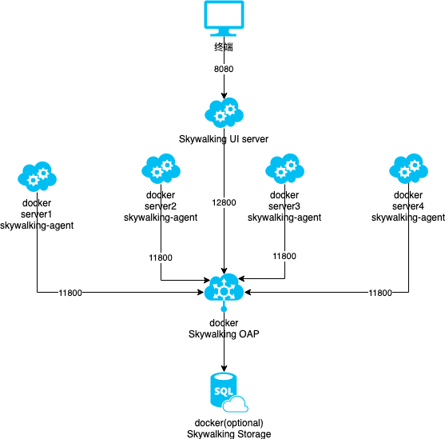

## Tasking 

- [x] ks8 基本概念
    - Namespace: 用来划分多个虚拟机群，可以为不同团队或业务群组提供资源隔离。 
    - Pod: k8s 的最小调度单元，应用服务的逻辑宿主机。部署几个服务，就有几个 Pod
    - Replication Controller：Pod 的控制器，用于监控 Pod 的状态和维护 Pod 的数量，主要功能包括Pod数量控制，健康监控、弹性伸缩、滚动升级
    - Service: 为一组相同功能的 Pod 提供统一的对外访问，具备一定的 Pod 发现和负载均衡能力。
    - Label: 为 Pod 设置标签，通常相同功能的服务会设置相同的 Label，这样 Service 就可以通过 Label 去选择 Pod
    - Deployment: Replication Controller 的升级版，提供更细粒度的监控能力，提供版本管理、回退、暂停升级、继续升级
- [x] Skywalking 各个组成部分是什么
    - Probes(探头)：不同来源的数据会使用不同的 Probes，它们会收集数据并根据 Skywalking 的要求重新格式化数据 
    - Platform backend：支持集群，用于聚集和分析从 Probes 搜集来的数据，并把数据从 Probes 推给 UI，可以根据 OAL 语言组定义聚合和分析
    - Storage：存储 Probes 收集的数据，提供多种存储选择，例如 ES、H2、Mysql 等
    - UI：Skywalking 的图形界面
- [x] Skywalking 每个组成部分 对应 k8s 的概念
    - Probes 对应一个 Pod(k8s)
    - 多个 Probes Pod 对应一个 Deployment(k8s)
    - 多个 Probes Deployment 对应一个 Service(k8s)
    - Platform backend 单独一个 Pod，并且为其设置
    
- [x] Skywalking 每个组成部分 对应使用的组件
    1. Probes -> skywalking agent
    2. Platform backend -> skywalking OAP
    3. UI -> skywalking UI
    4. Storeage -> ES、H2、Mysql ...
- [x] Skywalking 每个组件对应的 docker image
    1. Probes -> registry.cn-shenzhen.aliyuncs.com/lyning/skywalking-agent:6.2.0
    2. OAP Server -> apache/skywalking-oap-server:6.2.0 
    2. UI -> apache/skywalking-ui:6.2.0
   
- [ ] docker 部署方案
    - [x] spring cloud server 的 Dockerfile 加入 skywalking-agent:6.2.0 images
    - [x] 配置并启动 apache/skywalking-oap-server:6.2.0 ->  -> `docker run --restart always -d -e SW_STORAGE=h2 apache/skywalking-oap-server`
        - [x] 配置端口
        - [x] 配置IP
        - [x] 启动镜像
    - [x] 配置并启动 apache/skywalking-ui:6.2.0 ->  -> `docker run -p 8080:8080 --restart always -d -e SW_OAP_ADDRESS=oap:12800 apache/skywalking-ui`
        - [x] 配置端口
        - [x] 配置IP
        - [x] 启动镜像
    - [x] 配置 agent 并启动 spring cloud server 的 docker image
        - [x] 增加 --javaagent:/agent-path.jar
        - [x] 将将变量传入 javaagent
        - [x] 启动镜像
    - [ ] 仓储
        - [x] H2 -> `docker run --restart always -d -e SW_STORAGE=h2 apache/skywalking-oap-server`
        - [ ] Mysql
        - [ ] ES 6.5 -> `docker run --restart always -d -e SW_STORAGE=elasticsearch -e SW_STORAGE_ES_CLUSTER_NODES=elasticsearch:9200 apache/skywalking-oap-server`
- [ ] k8s 部署方案
## skywalking + docker 部署 拓扑图

## 问题
1. 为了避免出现意料之外的情况，所有的docker环境需要统一时区(UTC+8) `RUN ln -fs /usr/share/zoneinfo/Asia/Shanghai /etc/localtime`
